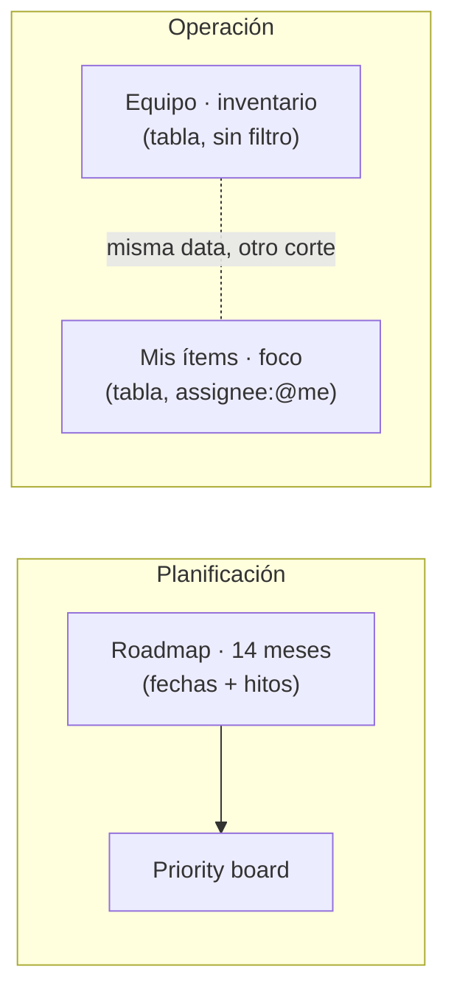

# GitHub Projects — ERP Satélite

El código vive en **`erp-satelite`**; el [Project 11](https://github.com/users/Abraha33/projects/11) es el tablero del producto. El diseño admite **equipo**, pero en la práctica **todo lo asignas a ti mismo**: usuario GitHub **[@Abraha33](https://github.com/Abraha33)**. En cada issue/proyecto, **Assignees** = tu cuenta; la vista **Mis ítems** usa el filtro `assignee:@me`, que es **el mismo usuario** (no hay otro dev en el tablero hoy).

**Git (ramas, no forks):** en el remoto solo **`main`** (estable) y **`develop`** (integracion); ramas temporales opcionales para PR a `develop`. Un *fork* de GitHub es otra copia del repo (contribuciones externas); no es la rama `develop`. Tabla y rutina en el [README §3.2](https://github.com/Abraha33/erp-satelite/blob/main/README.md#32-ramas-git-solo-main-y-develop).

**Workflows (7 automatizaciones):** no hay API para encenderlos; guía en [docs/GITHUB_PROJECT_WORKFLOWS.md](./GITHUB_PROJECT_WORKFLOWS.md) (sección *Activar workflows nº 2 a 7*). Estado actual: `python scripts/project_workflows_status.py --from-num 2 --to-num 7` → [Workflows en el navegador](https://github.com/users/Abraha33/projects/11/workflows).

**IDs en títulos y orden:** convención `[T##]` (ROADMAP) y `[E##-S##-##]` (SCRUM) en [docs/TICKET_ID_CONVENTION.md](./TICKET_ID_CONVENTION.md). Para ver tickets **de primero a último** en una vista: **View** → **Sort** → **Title** → **Ascending** (y guarda la vista). Normalizar issues antiguos: `python scripts/normalize_issue_title_prefixes.py` (vista previa) y `python scripts/normalize_issue_title_prefixes.py --apply`.

---

## Mapa rápido: qué pestaña abrir



| Necesitas… | Abre |
|------------|------|
| Ver **todo** el trabajo, **por persona**, **tamaño**, **prioridad**, PRs y subtareas | [Tabla equipo — views/3](https://github.com/users/Abraha33/projects/11/views/3) |
| Ver **solo tu cola** (`assignee:@me` = **@Abraha33**) | [Mis ítems — views/5](https://github.com/users/Abraha33/projects/11/views/5) |
| Mover tarjetas por **estado** como Kanban | Board del proyecto o [Priority board](https://github.com/users/Abraha33/projects/11/views/2) — filtros `no:Priority` / `has:Priority`: [guía](#filtros-priority-con-y-sin-valor) |
| **Línea de tiempo** (barras por fechas, hitos, sin Done) | [Roadmap · 14 meses — views/8](https://github.com/users/Abraha33/projects/11/views/8) |

---

## Equipo · inventario (la vista “team”)

**Propósito:** misma idea que **Team items** en [Factura SaaS API Roadmap](https://github.com/users/Abraha33/projects/5): **tabla** (no board), **panel izquierdo por Assignees**, **grupos por Status** en el cuerpo de la tabla, columnas **Title → Status → PRs → Sub-issues → Size**, y **Field sum** de **Size** en las cabeceras de grupo (el *Estimate* de la captura).

**Enlace en ERP (pestaña existente):** [Team items — views/3](https://github.com/users/Abraha33/projects/11/views/3). Puedes renombrarla a **Equipo · inventario** (menú **···** → **Rename view**).

### Paridad con la captura Factura (checklist)

| Qué ves en Factura | Qué tocar en GitHub (**View** junto al filtro) |
|--------------------|-----------------------------------------------|
| Lista con filas agrupadas, no Kanban | **Layout** → **Table**. Si tu vista estaba en **Board**, por eso no se parece: el API marca `BOARD_LAYOUT` en lugar de tabla. |
| Panel **Assignees** a la izquierda (conteos por persona, *No assignees*) | **Slice by** → **Assignees** |
| Cabeceras plegables **Backlog** / **Ready** / … con texto de estado | **Group by** → **Status** |
| *Estimate: N* en la cabecera del grupo | **Field sum** → activa **Size** (y rellena **Size** en los ítems) |
| Columnas de la tabla | **Fields** → al menos **Title**, **Status**, **Linked pull requests**, **Sub-issues progress**, **Size** |

### Comprobar desde el repo

```bash
cd erp-satelite
python scripts/verify_team_items_layout.py
```

Debe salir **OK** con `layout: TABLE_LAYOUT`, `groupByFields` con **Status** y `verticalGroupByFields` vacío (así está configurado [Factura — Team items](https://github.com/users/Abraha33/projects/5/views/3) en la API). Si ves `BOARD_LAYOUT`, falta cambiar a **Table**.

### Columnas extra (opcional, ERP)

Cuando quieras más contexto sin perder el aspecto Factura, añade en **Fields**, por ejemplo: **Repository**, **Assignees**, **Labels** (solo `role/*` y `priority/P*`), **Priority**, **Milestone**, **Status update**. Política de etiquetas: [Etiquetas en issues (mínimo)](#etiquetas-en-issues-mínimo-rol--prioridad).

### Orden sugerido en la UI (~2 min)

1. Abre [views/3](https://github.com/users/Abraha33/projects/11/views/3).
2. **View** → **Layout** → **Table**.
3. **View** → **Slice by** → **Assignees**.
4. **View** → **Group by** → **Status**.
5. **View** → **Field sum** → **Size**.
6. **View** → **Fields**: activa las cinco columnas mínimas (arriba); desactiva el resto hasta que quede limpio.
7. Opcional: **Sort** por **Status** o **Priority**.

### Filtros por Assignees (sin asignar y por persona)

En [views/3](https://github.com/users/Abraha33/projects/11/views/3) la barra **Filter by keyword or by field** usa la [misma sintaxis](https://docs.github.com/en/issues/planning-and-tracking-with-projects/customizing-views-in-your-project/filtering-projects) que el resto del proyecto. Para **Equipo** interesa ver quién tiene carga y qué quedó huérfano.

**Panel lateral (rápido):** con **Slice by → Assignees** activo, en el lateral aparecen entradas por persona y suele existir **No assignees** / sin asignatarios: al hacer clic en una fila del panel, la tabla se **filtra** solo a esa asignación (es el comportamiento tipo Factura SaaS “Team items”).

**Filtros que puedes escribir en la barra** (combinan con AND salvo que indiques comas para OR en el mismo campo):

| Qué quieres ver | Escribe en el filtro |
|-----------------|----------------------|
| Sin nadie asignado | `no:assignee` |
| Con al menos un asignado | `has:assignee` |
| Solo lo tuyo | `assignee:@me` o `assignee:Abraha33` |
| Solo lo de otro usuario | `assignee:LOGIN` (sustituye `LOGIN`) |
| Varios posibles (OR) | `assignee:Abraha33,otroLogin` |
| Asignado a **dos** a la vez (AND) | `assignee:user1 assignee:user2` |

**Guardar el filtro en esta vista:** tras ajustar filtro y columnas, abre **View** (engranaje) y usa la opción para **guardar** / aplicar cambios a la vista actual (según versión de GitHub: “Save” o editar vista), para no perder el filtro al volver otro día. Si no guardas, el filtro puede resetearse al cambiar de pestaña.

**Recomendación operativa:** deja la vista **sin filtro guardado** (`assignee` vacío) para ver **todo el equipo**; usa `no:assignee` en sesiones de triage para limpiar tarjetas huérfanas, y el lateral **Assignees** para enfocarte en una persona sin crear otra pestaña.

### API / repo (si tu `gh` puede escribir vistas)

En `scripts/` están `patch-view-team-visible-fields.json` (IDs REST de las **cinco columnas** alineadas a Factura: Title, Status, Linked PRs, Sub-issues, Size), `apply-team-view-fields.ps1` (`PATCH` sobre **views/3**) y `verify_team_items_layout.py`. Si `PATCH …/views/3` devuelve **404**, es normal en proyectos de usuario: aplica **Layout / Slice / Group / Fields** a mano y vuelve a correr el verificador.

`view-team-table.json` documenta el mismo `layout: table` y columnas para **recrear** la vista si la borras.

### Etiquetas en issues (mínimo: rol + prioridad)

**Política:** en el repo solo **`role/*`** y **`priority/P0`…`priority/P3`**. No hace falta `area/*`, `tipo/*`, `fase-*`, `MVP`, `Sprint-N`, etc.: el **ámbito** y el **tipo** van en el cuerpo del issue; la **fase** en **Milestone**; las **etapas** (backlog, en curso, hecho) en el **campo Status** del Project — no como etiquetas.

| Label | Uso |
|-------|-----|
| `role/*` | Uno por issue — capa de trabajo (tabla completa en [README §4](https://github.com/Abraha33/erp-satelite/blob/main/README.md#4-sistema-de-labels-mínimo)). |
| `priority/P0` … `priority/P3` | Opcional en chips; alinea con el campo **Priority** del tablero (mismo P0–P3). |

**Crear labels en el repo:** `python scripts/ensure_role_labels.py` (idempotente: `role/*` + `priority/*`).

**Alinear issues con la política (sin duplicar legacy):** `python scripts/harmonize_legacy_role_labels.py` (quita `frontend`/`backend`/`database`/`docs` cuando ya existe el `role/*` equivalente). Con `--dry-run` primero.

**Visor local (issues en GitHub por `role/*`, sin API):** en el monorepo `ERP1`, abre [docs/TICKETS_POR_ROL.md](../../docs/TICKETS_POR_ROL.md) o [docs/visor-tickets-por-rol.html](../../docs/visor-tickets-por-rol.html) en el navegador.

### Filtrar por rol **sin** vistas nuevas

**Política:** no crees vistas adicionales solo para separar frontend / backend / database. Usa las **vistas que ya tienes** y el **cuadro de filtro** (barra de búsqueda del Project) añadiendo `label:role/...` cuando quieras acotar por capa.

**Vistas existentes (Project 11):** [Priority board · views/2](https://github.com/users/Abraha33/projects/11/views/2), [Equipo · inventario · views/3](https://github.com/users/Abraha33/projects/11/views/3), [Mis ítems · foco · views/5](https://github.com/users/Abraha33/projects/11/views/5), [Foco semana · views/10](https://github.com/users/Abraha33/projects/11/views/10), [Roadmap · views/8](https://github.com/users/Abraha33/projects/11/views/8).

**Ejemplos de filtro (los escribes encima de la vista; combinan con lo que ya filtre cada una):**

| Situación | Qué añadir en el filtro |
|-----------|-------------------------|
| Solo tickets **database** en tu cola | `label:role/database` (en **Mis ítems** ya suele ir implícito `assignee:@me`; si no, añádelo) |
| Solo **frontend** en foco sprint | En **Foco semana**: `label:role/frontend` |
| Priority board solo **backend** | En **Priority board**: `label:role/backend` |
| Inventario equipo solo **integración** | En **Equipo**: `label:role/integration` |
| Timeline solo **CRM** | En **Roadmap**: `label:role/crm` (y conserva `-status:Done` si lo usas) |

**Importante — no “ensucies” la vista guardada:** si en el menú de la vista **guardas** un filtro fijo por rol, esa pestaña dejará de mostrar el tablero completo. Lo recomendable en **solo dev** es usar el filtro de rol **solo mientras trabajas** y luego **quitar** la parte `label:role/...` (o volver al filtro por defecto de esa vista), para que Priority / Mis ítems sigan sirviendo como inventario global.

**Clasificación en issues:**

1. **Un** `role/*` por issue.
2. **Como máximo un** `priority/P*`; el **Priority board** ordena por el **campo** Priority del Project — mantén campo y label coherentes.
3. **Status** del Project = etapa (Backlog, In progress, …); no uses etiquetas para eso.

Activa la columna **Labels** en **Fields** si quieres ver rol + prioridad en la tabla; **Status** y **Priority** como campos del proyecto.

### Si todo está asignado a ti

Sigue siendo la vista correcta para **inventario + etiquetas + métricas**. **Mis ítems** es el recorte `assignee:@me` para el día a día.

---

## Mis ítems · foco (vista personal)

**Propósito:** lista **solo** issues con **`assignee:@me`**, es decir asignados a **tu usuario @Abraha33**. Ideal para “¿qué me toca hoy?” sin ver todo el proyecto. Si un ítem no te aparece aquí, asígnatelo en **Assignees**.

**Enlace:** [views/5](https://github.com/users/Abraha33/projects/11/views/5).

Renombra la pestaña si aún dice *My items*: **Mis ítems · foco** (menú **···** → **Rename view**).

**Recreación:** `scripts/view-my-items-table.json` (incluye **Status update** junto a **Status**; más el filtro `assignee:@me`).

---

## Equipo vs Mis ítems (resumen)

| | Equipo · inventario | Mis ítems · foco |
|--|---------------------|------------------|
| **Filtro** | Por defecto **ninguno** (todo el proyecto). Puedes aplicar `no:assignee`, `has:assignee`, `assignee:LOGIN`, etc. — [tabla en Equipo](#filtros-por-assignees-sin-asignar-y-por-persona). **Slice by → Assignees** filtra al clicar en cada persona. | Fijo: `assignee:@me` (= **@Abraha33**) |
| **Pregunta que responde** | Inventario del equipo + triage de sin asignar | Solo tu cola |
| **Énfasis** | Assignees, Priority, Size, PRs, subtareas | Mismas columnas, vista personal |

---

## Roadmap: 14 meses

**Propósito:** ver el trabajo en el **eje temporal** (no el Kanban): qué ocupa el calendario, cómo se solapan fases y sprints. Complementa **Milestone** en el issue con **fechas explícitas** en el proyecto.

**Vista recomendada:** [views/8](https://github.com/users/Abraha33/projects/11/views/8) — nombre **Roadmap · 14 meses**, filtro guardado **`-status:Done`** para que el timeline no se llene de ítems cerrados.

Si aún tienes una pestaña antigua solo llamada **Roadmap** (p. ej. [views/4](https://github.com/users/Abraha33/projects/11/views/4)), puedes **eliminarla** (**···** → **Delete view**) y quedarte con **views/8**.

### Campos de fecha (ya en Project 11)

| Campo | Uso |
|-------|-----|
| **Roadmap · inicio** | Inicio de la barra en el timeline (epic, fase o ticket grande). |
| **Roadmap · fin** | Fin previsto; sin esto la barra no cierra bien. |

Creados vía API (`scripts/field-roadmap-inicio.json`, `scripts/field-roadmap-fin.json`). En issues **no** sustituyen a **Milestone** del repo: el milestone sigue siendo el “hito oficial”; las fechas son **planificación fina** en el tablero.

### Configuración en GitHub (~2 minutos)

Hazlo una vez por vista roadmap:

1. Abre [views/8](https://github.com/users/Abraha33/projects/11/views/8).
2. **Date fields** (arriba a la derecha): **Start date** → **Roadmap · inicio**, **Target date** → **Roadmap · fin**.
3. **Markers**: activa **Milestones** (y si quieres **iterations**) para líneas verticales alineadas con hitos.
4. **Zoom**: para horizonte ~14 meses suele ir mejor **Quarter** o **Year**; **Month** si estás detallando un sprint.
5. **View** (junto a la búsqueda):
   - **Group by** → **Milestone** (o **Status** si aún no tienes milestones en todos los ítems).
   - **Field sum** → **Size** (suma esfuerzo por grupo en cabeceras).
   - **Slice by** → opcional **Priority** o **Milestone** para panel lateral y filtrado rápido.

### Qué rellenar en cada ítem

| Tipo de ítem | Roadmap · inicio / fin | Milestone repo |
|--------------|-------------------------|----------------|
| Epic / fase (pocos) | Rango que cubre la fase | Sprint o release donde “aterriza” |
| Tickets de sprint | Opcional: ventana del sprint | Sprint actual |
| Chores sin fecha | Vacío (no aparecen como barra útil) | Según convenga |

Sin fechas en **Roadmap · inicio**, el ítem **no** se posiciona en el timeline: es normal para tareas micro; prioriza fechas en **trabajo que quieres ver en el calendario**.

### Filtro de la vista

La vista **views/8** incluye **`-status:Done`**: el roadmap se centra en lo **activo**. Si quieres ver histórico completado, quita el filtro desde la barra de búsqueda del proyecto o duplica la vista como **Roadmap · histórico** sin negación de Done.

---

## Paleta de color (Project 11)

Objetivo: **cada estado se distingue a primera vista** y **Priority** no compite con **In progress** (por eso P2 ya no es amarillo).

### Status (columnas del board)

| Estado | Color GitHub | Lectura rápida |
|--------|--------------|----------------|
| **Icebox** | Rosa (`PINK`) | Ideas / nevera — calidez sin mezclarlas con trabajo “en plan”. |
| **Backlog** | Gris (`GRAY`) | Inventario planificado — neutro, sin sensación de “ya en marcha”. |
| **Ready** | Azul (`BLUE`) | Cola del sprint — “listo para coger”. |
| **In progress** | Amarillo (`YELLOW`) | Foco activo — único amarillo fuerte del flujo. |
| **In review** | Morado (`PURPLE`) | QA / revisión — cierre de calidad. |
| **Done** | Verde (`GREEN`) | Completado — cierre positivo (antes naranja; verde = hecho). |

### Priority (filas del Priority board)

| Nivel | Color GitHub | Uso |
|-------|--------------|-----|
| **P0** | Rojo | Urgente / bloqueante |
| **P1** | Naranja | Alta — sprint actual |
| **P2** | Azul | Media — no usa amarillo (reservado a *In progress*) |
| **P3** | Gris | Baja — cola tranquila |

Mutaciones: `scripts/graphql/replace-status-priority-board.graphql`, `scripts/graphql/replace-priority-palette.graphql`. Tras cambiar colores hay que **remapear** valores: `python scripts/migrate_status_to_priority_board.py` y `python scripts/migrate_priority_palette.py`.

---

## Kanban (Status: Icebox + Factura SaaS / Priority board)

Orden del campo **Status** en Project 11 (izquierda → derecha en el board):

**Icebox → Backlog → Ready → In progress → In review → Done**

La columna **Icebox** (“la nevera”, *algún día*) va **a la izquierda de Backlog**: ideas que quieres **guardar sin mezclarlas** con el plan ejecutable de ~14 meses (ej. ideas a las 3 AM). **Backlog** sigue siendo el cajón de trabajo **en alcance** pero no del sprint actual; **Ready** es la cola del sprint.

| Columna (Status) | Color (GitHub) | Uso operativo |
|------------------|----------------|---------------|
| **Icebox** | Rosa | *Algún día / nevera.* Ideas fuera del plan activo; no ensucian Backlog. Revisión ocasional; promueves a **Backlog** cuando sí entra en roadmap. |
| **Backlog** | Gris | Trabajo en alcance ~14 meses que **sí** planeas ejecutar; aún no es sprint. |
| **Ready** | Azul | Cola del **sprint** (~2 semanas). Máx. **5–7** tickets como regla mental. |
| **In progress** | Amarillo | **Como mucho 1 tarjeta** en serio. Si tocas Supabase, no el Scraper. |
| **In review** | Morado | Compila en Cursor; prueba en **celular o navegador**. Si falla → **In progress**. |
| **Done** | Verde | Cerrado / entregado. |

**Migración / schema:** `scripts/graphql/replace-status-priority-board.graphql` + `scripts/migrate_status_to_priority_board.py`. Esquema legado: `To Do` → **Ready**, `In Progress` → **In progress**, `Testing / QA` → **In review**.

---

## Otras vistas

| Vista | Tipo | Enlace | Uso |
|-------|------|--------|-----|
| **Priority board** | Board | [views/2](https://github.com/users/Abraha33/projects/11/views/2) | Columnas = **Status** (Icebox…Done), filas = **Priority** (ver [abajo](#priority-board-como-factura-saas-api-roadmap)). |
| **Foco semana** | Board (filtro activo) | [views/10](https://github.com/users/Abraha33/projects/11/views/10) | Solo **Ready / In progress / In review** — [pack experto](#pack-experto). Replica **Group by / Column field** como Priority board. |
| **Roadmap · 14 meses** | Roadmap | [views/8](https://github.com/users/Abraha33/projects/11/views/8) | Timeline con fechas **Roadmap · inicio/fin**, hitos y filtro sin **Done** — [guía completa](#roadmap-14-meses). |
| *(antigua)* **Roadmap** | Roadmap | [views/4](https://github.com/users/Abraha33/projects/11/views/4) | Si convive con **views/8**, borra esta pestaña. |
| **Team items** / **Equipo** | **Table** (+ Slice **Assignees**, Group **Status**) | [views/3](https://github.com/users/Abraha33/projects/11/views/3) | Paridad [Factura Team items](https://github.com/users/Abraha33/projects/5/views/3) — [guía](#equipo--inventario-la-vista-team). Si la API muestra `BOARD_LAYOUT`, cambia **View → Layout → Table**. |

Si hay **dos** pestañas “My items”, borra la del layout **Board** ([views/5](https://github.com/users/Abraha33/projects/11/views/5) suele ser la antigua).

**Opcional:** desde **+ New view**, añade **Foco de hoy** (board con `Status` ∈ Ready, In progress, In review).

**Recrear vistas** (si las borras): `scripts/create-project-views.ps1` y los `scripts/view-*.json`, por ejemplo:

```powershell
cd erp-satelite/scripts
gh api -X POST -H "X-GitHub-Api-Version: 2026-03-10" "users/Abraha33/projectsV2/11/views" --input view-priority.json
```

---

## Priority board (como Factura SaaS API Roadmap)

### Si el tablero “se ve igual” que un Kanban simple (sin filas P0–P3)

GitHub **no** expone hoy (REST ni GraphQL público) una forma fiable de fijar **Group by** en proyectos de **usuario**; por eso el repo no puede “empujar” esa opción por script. Lo que sí podemos comprobar es si la vista está mal configurada:

```bash
cd erp-satelite
python scripts/verify_priority_board_layout.py
```

- Si `groupByFields` sale **vacío** y solo ves `verticalGroupByFields: Status`, el board es **solo columnas por estado** (como en tu captura): **falta un clic** en la UI.
- La referencia [Factura SaaS — Priority board](https://github.com/users/Abraha33/projects/5/views/2) tiene en la API **`groupByFields: Priority`** y **`verticalGroupByFields: Status`**. ERP debe replicar eso a mano: **View → Group by → Priority**.

Cuando lo hayas hecho, vuelve a ejecutar el script: debe terminar con **OK** y código de salida `0`.

Si aparece una pestaña extra **«API test view delete me»**, bórrala desde el menú **···** de la pestaña (fue una prueba de API; no afecta al proyecto).

---

**Idea:** board con **columnas = Status** y **filas = Priority** (swimlanes). Columnas (orden): **Icebox** (nevera) → **Backlog** → **Ready** → **In progress** → **In review** → **Done**. Filas: **No priority / P0 / P1 / P2 / P3**. La referencia Factura SaaS no tenía Icebox; en ERP es la primera columna a la izquierda.

| Eje | Configuración |
|-----|----------------|
| **Columnas** | Campo **Status** (las seis opciones: Icebox…Done). |
| **Filas** | Campo **Priority** — sin valor → **No priority** (todas las tarjetas se amontonan ahí hasta que rellenas P0–P3). |

### Paridad visual con tu captura (Factura SaaS Priority board)

La referencia [Project 5 — Factura SaaS](https://github.com/users/Abraha33/projects/5) se ve así: **5 columnas de Status**, arriba barra de filtro, y **filas horizontales** tipo `> No Priority` con contador de ítems y **Estimate** en cabecera. Para que [Priority board ERP (views/2)](https://github.com/users/Abraha33/projects/11/views/2) quede **casi igual**, configura en este orden:

```text
                    │ Icebox │ Backlog │ Ready │ In progress │ In review │ Done │
  Fila "No priority"│   ·    │ 9 tarj. │   ·   │      ·      │     ·     │  ·   │
  Fila "P0"         │   ·    │    ·    │   ·   │      ·      │     ·     │  ·   │
  …                 │        │         │       │             │           │      │
```

1. **Layout:** **View** → **Board** (no tabla ni roadmap).
2. **Column field:** **Status** (genera las columnas verdes/azul/amarillo… según opciones del campo).
3. **Group by (filas):** **Priority** → aparece el encabezado plegable **No priority** (y P0, P1… cuando existan).
4. **Field sum:** activa suma de **Size** → en la UI suele mostrarse como total por columna/fila (equivalente al **Estimate: 0** de la captura). Rellena **Size** en las tarjetas para que deje de ser 0.
5. **Límites WIP:** en **···** de cada columna → **Column limit** (ej. Backlog `5`, In progress `3`, In review `5`); si te pasas, el contador en rojo como en Factura.
6. **Orden de columnas:** arrastra cabeceras hasta dejar **Icebox** a la extrema izquierda y luego **Backlog → … → Done** (Factura solo tenía cinco columnas porque no usa Icebox).
7. **Textos bajo el título de columna** (“This item hasn't been started”, etc.) vienen de las **descripciones** del campo Status en el proyecto; en ERP ya están en inglés alineados con ese estilo.
8. **Tarjetas (Assignees, Labels, etc. en la cara):** en la barra del proyecto, **View** → en **Configuration** → **Fields** → marca los campos que quieras ver u ocultar en cada tarjeta (incluye **Assignees** y **Labels**). Documentación oficial: [Customizing the board layout → Showing and hiding fields](https://docs.github.com/en/issues/planning-and-tracking-with-projects/customizing-views-in-your-project/customizing-the-board-layout#showing-and-hiding-fields). Si el campo está vacío en el issue, no hay nada que pintar: por eso conviene triage inicial con `bulk_triage_project_items.py` (abajo).

**Diferencias de color respecto a la captura:** en Factura **Backlog** suele verse verde y **Done** naranja; en ERP la [paleta actual](#paleta-de-color-project-11) usa **Backlog gris** y **Done verde** a propósito (nevera rosa, etc.). Si en el futuro quieres **clonar exactamente** los colores Factura, habría que cambiar opciones en `replace-status-priority-board.graphql` y volver a correr `migrate_status_to_priority_board.py`.

### Prioridad: campo del Project y etiqueta `priority/P*`

El **Priority board** agrupa por el **campo** **Priority** (P0–P3). Las etiquetas **`priority/P0`…`priority/P3`** son el único otro lugar donde marcas prioridad en el issue: úsalas **en el mismo nivel** que el campo, para filtros en la lista de issues del repo (`label:priority/P1`) y chips en la vista Equipo. Evita mezclas con `alta`/`media`/`baja` u otras etiquetas viejas.

### Resumen de diseño (Priority board)

1. **Rellenar Priority** en todo lo que esté en Backlog / Ready / … (triage). Objetivo: **cero tarjetas de trabajo activo** en la fila **No priority** salvo borradores recién creados.
2. **Size** + **Field sum** = mismo rol que *Estimate* en Factura SaaS (totales por fila y columna cuando agrupas).
3. **WIP** en columnas de Status (Backlog, In progress, In review) para ver sobrecarga en rojo.
4. Usa los **filtros por Priority** ([tabla abajo](#filtros-priority-con-y-sin-valor)) para ver solo lo priorizado o solo lo que falta por triage.

**Auditar qué falta:** `python scripts/list_items_missing_priority.py` (lista issues del proyecto sin Priority).

**Dos filas “No priority” en el board:** GitHub agrupa aparte los ítems con **Priority vacío** y los que tienen la opción explícita **No Priority**. Para dejar **una sola fila** (la de la opción explícita), sin borrar tarjetas: `python scripts/merge_empty_priority_to_no_priority.py` (ver `--dry-run`).

**Triage masivo (Priority + assignee en issues):** si casi todo cae en la fila **No priority** y las tarjetas no muestran avatar, suele ser que el **campo Priority** está vacío y los **issues** no tienen asignatarios. Relleno por defecto **P3** + `gh issue edit --add-assignee` (el CLI no expone assignees en `item-edit`):

```bash
cd erp-satelite
python scripts/bulk_triage_project_items.py --dry-run   # ver comandos
python scripts/bulk_triage_project_items.py --priority P3 --assignee Abraha33
```

Luego ajusta manualmente **P0–P2** en lo que sea urgente o del sprint actual.

### Filtros Priority (con y sin valor)

En [Priority board (views/2)](https://github.com/users/Abraha33/projects/11/views/2), la barra de filtro del proyecto acepta calificadores sobre campos personalizados (ver [Filtering projects](https://docs.github.com/en/issues/planning-and-tracking-with-projects/customizing-views-in-your-project/filtering-projects)).

| Qué quieres ver | Escribe en el filtro (prueba si el primero no filtra) |
|-----------------|--------------------------------------------------------|
| **Sin priorizar** (vacío → swimlane *No priority*) | `no:Priority` o `no:priority` |
| **Ya priorizados** (tienen P0–P3) | `has:Priority` o `has:priority` |
| Solo **P0** | `priority:P0` o `Priority:P0` |
| Solo **P1** | `priority:P1` |
| Varios niveles (OR) | `priority:P0,priority:P1` o según autocomplete de GitHub |
| Combinar con estado | Ej. `has:Priority status:Backlog` (AND entre condiciones) |

**Slice by:** si en **View** activas **Slice by → Priority**, el panel lateral permite acotar por **P0 / P1 / …** y suele incluir la opción para ítems **sin** valor en Priority (equivalente visual a “no priorizados”) sin escribir `no:Priority`.

**Guardar:** tras poner el filtro, guarda los cambios de la vista desde el menú **View** para que persistan al volver a abrir el proyecto.

### Configuración en GitHub (~2 min)

1. Abre [Priority board](https://github.com/users/Abraha33/projects/11/views/2).
2. **View** (junto al filtro) → layout **Board**.
3. **Group by** → **Priority** (filas). **Column field** → **Status** (columnas).
4. **Field sum** → **Size** (totales por grupo, como el *Estimate* de la referencia).
5. **Límites WIP** (solo UI): **···** en cada cabecera de columna → **Column limit**:
   - **Icebox** → sin límite (o alto, ej. `50`) — es almacén de ideas, no WIP de ejecución.
   - **Backlog** → `5` (como referencia Factura SaaS)
   - **In progress** → `3`
   - **In review** → `5`  
   *(Ready / Done: a tu criterio.)* Si superas el límite, el contador se resalta en rojo (aviso visual).

### Pack experto

**Objetivo:** tablero legible en el día a día: totales de **Size** con sentido, prioridad coherente en columnas de ejecución, y un corte “solo esta semana”.

| Capa | Qué hacer |
|------|-----------|
| **Datos** | `python scripts/priority_board_hygiene.py --dry-run --fill-size --bump-active-priority` luego sin `--dry-run`. Rellena **Size** (por defecto `2`) en **Ready / In progress / In review** si está vacío; sube **No Priority** (o vacío) a **P2** solo en esas columnas. |
| **Vista extra** | **[Foco semana — views/10](https://github.com/users/Abraha33/projects/11/views/10)** (board con filtro `status:Ready OR status:"In progress" OR status:"In review"`). Creada vía `scripts/view-priority-foco-semana.json` + `POST …/views`. En esa vista (y en [Priority board — views/2](https://github.com/users/Abraha33/projects/11/views/2)) replica **Group by → Priority**, **Column field → Status**, **Field sum → Size** (la API no los guarda al crear la vista). |
| **UI** | **Slice by → Priority**; **Sort** opcional por **Size** (desc) en columnas de trabajo; **View → Fields** en tarjetas: **Assignees**, **Labels**, **Milestone**, **Size**, **Priority**, **Status update**; **WIP** como en la tabla de arriba. |

Atajo (PowerShell, desde `erp-satelite`): `.\scripts\apply-priority-board-expert.ps1` (dry-run); `.\scripts\apply-priority-board-expert.ps1 -Run` aplica la higiene.

### Campos personalizados (Project 11)

- **Priority** — P0…P3 (paleta en [Paleta de color](#paleta-de-color-project-11)). `scripts/field-priority.json` + `scripts/graphql/replace-priority-palette.graphql`.
- **Size** — número (equivale al *Estimate* de la referencia). `scripts/field-size.json`.
- **Roadmap · inicio** / **Roadmap · fin** — timeline. `scripts/field-roadmap-inicio.json`, `scripts/field-roadmap-fin.json`.
- **Status update** — texto; nota rápida por ítem (bloqueo, avance, “esperando X”). `scripts/field-status-update.json`.

### Reglas prácticas (Priority)

- **P0** — bloquea o está roto en prod.
- **P1** — sprint actual.
- **P2** — siguiente / backlog cercano.
- **P3** — cuando sobre tiempo.

### Schema en el repo (Status + Priority)

- Status: `scripts/graphql/replace-status-priority-board.graphql` → `python scripts/migrate_status_to_priority_board.py`
- Priority (solo colores / opciones): `scripts/graphql/replace-priority-palette.graphql` → `python scripts/migrate_priority_palette.py`

---

## “No Status”

Ítems sin valor en **Status** (p. ej. tras cambiar opciones del campo). Script:

```bash
cd erp-satelite
python -u scripts/set_all_project_items_backlog.py
```

(Requiere `gh` autenticado.)

---

## Títulos de issues (Cursor y humanos)

Prefijos entre corchetes, título corto en español:

| Prefijo | Ejemplo |
|---------|---------|
| `[Setup]` | `[Setup] Inicializar proyecto Expo React Native en blanco` |
| `[Scraper]` | `[Scraper] Script Python para login en SAE` |
| `[DB]` | `[DB] Crear tabla de productos y RLS en Supabase` |
| `[Auth]` | `[Auth] Supabase Auth y perfiles por rol` |
| `[ERP]` / `[CRM]` | Alcance claro del módulo |

Evita títulos robóticos tipo `T3.1.1: Provider factory IoC` como título principal; el ID puede ir en cuerpo o etiqueta.

---

## Scripts útiles

| Documento | Uso |
|-----------|-----|
| [docs/GITHUB_PROJECT_WORKFLOWS.md](./GITHUB_PROJECT_WORKFLOWS.md) | **7 workflows** del Project (Backlog/Done, auto-add, auto-close, archive opcional). Solo UI. |

| Script | Uso |
|--------|-----|
| `scripts/project_workflows_status.py` | Qué workflows están ON/OFF (p. ej. `--from-num 2 --to-num 7`). No puede activarlos por API. |
| `scripts/open-project-workflows.ps1` | Abre la página **Workflows** del Project 11 en el navegador. |
| `scripts/priority_board_hygiene.py` | **Size** en columnas activas vacías + **No Priority → P2** en Ready / In progress / In review ([pack experto](#pack-experto)). |
| `scripts/view-priority-foco-semana.json` | Board **Foco semana** (filtro Ready + In progress + In review) → `POST users/…/projectsV2/11/views`. |
| `scripts/apply-priority-board-expert.ps1` | Imprime pasos; `-Run` ejecuta `priority_board_hygiene.py` sin dry-run. |
| `scripts/set_all_project_items_backlog.py` | Todos los ítems → **Backlog** (incluye lo que estaba en **Icebox**; usar solo para limpiar “No Status”). |
| `scripts/graphql/replace-status-priority-board.graphql` | Columnas Status estilo Factura SaaS (aplicadas en Project 11). |
| `scripts/migrate_status_to_priority_board.py` | Sustituye opciones Status y remapea ítems (To Do→Ready, etc.). |
| `scripts/graphql/replace-priority-palette.graphql` | Colores y textos del campo **Priority** (P2 azul, P3 gris). |
| `scripts/migrate_priority_palette.py` | Tras cambiar Priority en GraphQL, restaura P0–P3 en ítems que ya tenían prioridad. |
| `scripts/list_items_missing_priority.py` | Lista ítems del proyecto **sin** campo Priority (swimlane *No priority*). |
| `scripts/bulk_triage_project_items.py` | Rellena **Priority** en el proyecto (P0–P3 vía `gh project item-edit`) y **Assignees** en el issue (`gh issue edit`) para ítems vacíos. |
| `scripts/verify_priority_board_layout.py` | GraphQL: comprueba que **Group by = Priority** y columnas = **Status** (paridad con Factura SaaS). |
| `scripts/patch-view-priority-board.json` | Cuerpo PATCH teórico (`group_by` / `vertical_group_by` por IDs REST); suele **404** en proyectos de usuario hasta que GitHub lo habilite. |
| `scripts/graphql/replace-status-lean.graphql` | Esquema antiguo To Do / Testing QA (solo referencia histórica). |
| `scripts/import-backlog-to-github.py` | CSV → issues (puntual). |
| `scripts/view-team-table.json` | Tabla estilo Factura Team items (`layout: table`, 5 columnas) — recrear → [views/3](https://github.com/users/Abraha33/projects/11/views/3). |
| `scripts/patch-view-team-visible-fields.json` | Cuerpo `PATCH`: solo `visible_fields` (mismas 5 columnas) para [views/3](https://github.com/users/Abraha33/projects/11/views/3). |
| `scripts/apply-team-view-fields.ps1` | Ejecuta ese `PATCH` (si la API responde; **Layout/Group by** siguen siendo en la UI). |
| `scripts/verify_team_items_layout.py` | GraphQL: comprueba **Table** + **Group by Status** (paridad Factura Team items). |
| `scripts/view-my-items-table.json` | Tabla **Mis ítems · foco** con `assignee:@me`. |
| `scripts/view-roadmap.json` | Vista **Roadmap · 14 meses** (`layout: roadmap`, filtro `-status:Done`) → [views/8](https://github.com/users/Abraha33/projects/11/views/8). |
| `scripts/field-size.json` | Campo **Size**. |
| `scripts/field-status-update.json` | Campo de texto **Status update** (ya aplicado en Project 11; referenciado en `view-team-table.json` / `view-my-items-table.json`). |
| `scripts/field-roadmap-inicio.json` / `field-roadmap-fin.json` | Campos de fecha del roadmap (ya aplicados en Project 11). |

---

## Referencia Factura SaaS (API-Dian)

[Project 5 — Factura SaaS API Roadmap](https://github.com/users/Abraha33/projects/5): **Priority board** con columnas Backlog / Ready / … (sin Icebox). En Project 11 se añade **Icebox** a la izquierda de Backlog; el resto del flujo y **Priority** + **Size** coinciden con la idea del tablero de referencia.
